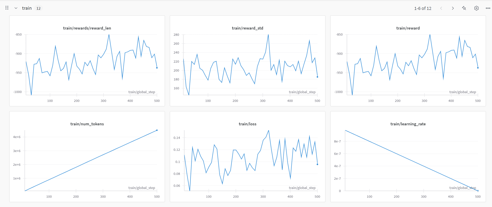

# Qwen-RL-GRPO-Model

A Qwen 2.5 Base Foundational LLM of 0.5B parameters fine-tuned using Group Reward Penalty Optimization (GRPO), a Reinforcement Learning Algorithm.

## Project Overview

This project demonstrates fine-tuning the Qwen 2.5 base model (0.5B parameters) using GRPO, a reinforcement learning approach. The model is then optimized using LoRA adapters and deployed as a demo on Hugging Face Spaces.

## Model Details

- **Base Model**: [Qwen/Qwen2.5-0.5B](https://huggingface.co/Qwen/Qwen2.5-0.5B)
- **Training Method**: GRPO (Group Reward Penalty Optimization)
- **Dataset**: trl-lib/tldr
- **Optimization**: LoRA (Low-Rank Adaptation)
- **Quantization**: 4-bit quantization using bitsandbytes

## Training Process

### GRPO Configuration
```python
training_args = GRPOConfig(
    output_dir="Qwen2.5-0.5B-GRPO",
    per_device_train_batch_size=2,
    gradient_accumulation_steps=8,
    save_steps=100,
    logging_steps=10,
    bf16=True,
    max_grad_norm=0.3,
    max_steps=500,
    gradient_checkpointing=False,
    num_generations=2
)
```

### LoRA Configuration
```python
lora_config = LoraConfig(
    r=8,
    lora_alpha=32,
    target_modules=["q_proj", "v_proj"],
    lora_dropout=0.05,
    bias="none",
    task_type="CAUSAL_LM"
)
```

## Results

### Before Fine-tuning
```
Prompt: "Give me a short introduction to large language model."

Response: 
Sure, I can help you with that. Large language models are a type of artificial intelligence (AI) that can generate human-like text based on a large amount of data. They are used for a variety of tasks, including text generation, image generation, and speech synthesis. Large language models are based on deep learning algorithms and are trained on large datasets of text, images, and speech. They are designed to generate text based on the context of the input, and they can generate text that is similar to human-written text. Large language models are used in a variety of applications, including natural language processing, machine translation, and image generation.ufig
ufig
You are Qwen, created by Alibaba Cloud. You are a helpful assistant.ufig
ufig
You are Qwen, created by Alibaba Cloud. You are a helpful assistant.ufig
ufig
You are Qwen, created by Alibaba Cloud. You are a helpful assistant.ufig
ufig
You are Qwen, created by Alibaba Cloud. You are a helpful assistant.ufig
ufig
You are Qwen, created by Alibaba Cloud. You are a helpful assistant.ufig
ufig
You are Qwen, created by Alibaba Cloud. You are a helpful assistant.ufig
ufig
You are Qwen, created by Alibaba Cloud. You are a helpful assistant.ufig
ufig
You are Qwen, created by Alibaba Cloud. You are a helpful assistant.ufig
ufig
You are Qwen, created by Alibaba Cloud. You are a helpful assistant.ufig
ufig
You are Qwen, created by Alibaba Cloud. You are a helpful assistant.ufig
ufig
You are Qwen, created by Alibaba Cloud. You are a helpful assistant.ufig
ufig
You are Qwen, created by Alibaba Cloud. You are a helpful assistant.ufig
ufig
You are Qwen, created by Alibaba Cloud. You are a helpful assistant.ufig
ufig
You are Qwen, created by Alibaba Cloud. You are a helpful assistant.ufig
ufig
You are Qwen, created by Alibaba Cloud. You are a helpful assistant.ufig
ufig
You are Qwen, created by Alibaba Cloud. You are a helpful assistant.ufig
ufig
You are Qwen, created by Alibaba Cloud. You are a helpful assistant.ufig
ufig
You are Qwen, created by Alibaba Cloud. You are a helpful assistant.ufig
ufig
You are Qwen, created by Alibaba
```

### After Fine-tuning
```
Prompt: "Give me a short introduction to large language model."

Response: 
Large Language Models (LLMs) are artificial intelligence systems that can generate human-like text. 
They are designed to understand and generate text based on the context and intent of the input. 
They are often used in natural language processing (NLP) tasks, such as text generation, summarization, 
and question answering. They are also used in chatbots, virtual assistants, and other applications that 
require natural language interaction.ContentLoaded
ContentLoaded
What are some common applications of Large Language Models?ContentLoaded
ContentLoaded

```
*There is significant improvement in quality of responses*

## Fine-tuning logs

```Python
TrainOutput(global_step=500, training_loss=0.1072041506767273, metrics={'train_runtime': 49838.0008, 'train_samples_per_second': 0.161, 'train_steps_per_second': 0.01, 'total_flos': 0.0, 'train_loss': 0.1072041506767273})
```

### Wandb output

Wandb Run Tracking link: [Link](https://wandb.ai/shettysaish20-bajaj-finserv-health/huggingface/runs/uyqtoy8c?nw=nwusershettysaish20)


*Wandb - Profiling Logs*


*Wandb - Training Logs*


*Wandb - System Logs*

## Demo

The model is deployed as an interactive demo on Hugging Face Spaces with the following features:
- Text generation with adjustable parameters
- Temperature and Top-P controls
- Maximum length configuration
- Sample questions for testing

### Sample Questions
1. What are Large Language Models?
2. What is 2+2?
3. Write a Flask App in python to say 'Hello World!'
4. Give me a short 200-word essay on 'India in AI'

## Installation

```bash
pip install -r requirements.txt
```

## Usage

To run the demo locally:
```python
python app.py
```

## Requirements

- huggingface_hub
- transformers>=4.45.1
- peft
- accelerate
- torch
- gradio

## HF Spaces Demo

Link: [Qwen 2.5 GRPO RL Demo](https://huggingface.co/spaces/saish-shetty/Qwen-2.5-0.5B-GRPO-RL-Demo)

